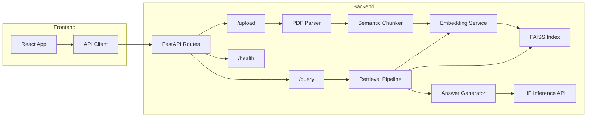

# Enterprise RAG Knowledge Assistant

A production-grade Retrieval-Augmented Generation platform for enterprise document search and AI-powered Q&A. Built with **FastAPI**, **FAISS**, **Sentence-Transformers**, and **React**.

## Architecture



## Tech Stack

| Layer | Technology |
|-------|-----------|
| **Embeddings** | `sentence-transformers/all-MiniLM-L6-v2` (local) |
| **Generation** | `mistralai/Mistral-7B-Instruct-v0.3` via HF Inference API |
| **Vector Store** | FAISS (`IndexFlatIP` with L2-normalized vectors) |
| **Backend** | FastAPI + Uvicorn |
| **Frontend** | React + Vite |
| **PDF Parsing** | PyPDF |
| **Token Counting** | tiktoken (`cl100k_base`) |

## Quick Start

### Prerequisites

- **Python 3.10+**
- **Node.js 18+**
- **Hugging Face API Token** (free tier works) — [Get one here](https://huggingface.co/settings/tokens)

### 1. Backend Setup

```bash
cd backend

# Create virtual environment
python -m venv venv
venv\Scripts\activate   # Windows
# source venv/bin/activate  # Linux/Mac

# Install dependencies
pip install -r requirements.txt

# Configure environment
copy .env.example .env
# Edit .env and add your HF_API_TOKEN
```

### 2. Start Backend

```bash
cd backend
uvicorn app.main:app --reload --host 0.0.0.0 --port 8000
```

The API will be available at `http://localhost:8000`. Interactive docs at `http://localhost:8000/docs`.

### 3. Frontend Setup

```bash
cd frontend
npm install
npm run dev
```

The UI will be available at `http://localhost:5173`.

### 4. Usage

1. Open `http://localhost:5173` in your browser.
2. **Upload** a PDF using the sidebar panel (drag-and-drop or click to browse).
3. Wait for ingestion to complete (you'll see chunk count).
4. **Ask questions** about your documents in the chat interface.
5. View the AI's answer with inline **citations** and **performance metrics**.

## API Reference

### `POST /api/upload`

Upload a PDF document for ingestion.

**Request:** `multipart/form-data` with `file` (PDF) and optional `title` (string).

**Response:**
```json
{
  "document_id": "uuid",
  "title": "document_name",
  "chunks_created": 42,
  "total_pages": 10,
  "processing_time_ms": 1234.5
}
```

### `POST /api/query`

Query the knowledge base.

**Request:**
```json
{
  "query": "What are the key findings?",
  "top_k": 5,
  "score_threshold": 0.3
}
```

**Response:**
```json
{
  "answer": "According to the report...",
  "citations": [
    {
      "document": "Annual Report",
      "page": 5,
      "chunk_id": "uuid",
      "score": 0.92
    }
  ],
  "metrics": {
    "retrieval_latency_ms": 45.2,
    "generation_latency_ms": 890.1,
    "total_latency_ms": 935.3,
    "chunks_retrieved": 3,
    "avg_similarity": 0.85
  }
}
```

### `POST /api/query/stream`

Streaming query via Server-Sent Events (SSE).

### `GET /api/health`

Service health check.

## Configuration

All settings are configured via environment variables (`.env` file):

| Variable | Default | Description |
|----------|---------|-------------|
| `HF_API_TOKEN` | — | Hugging Face API token (required) |
| `EMBEDDING_MODEL` | `sentence-transformers/all-MiniLM-L6-v2` | Local embedding model |
| `GENERATION_MODEL` | `mistralai/Mistral-7B-Instruct-v0.3` | HF generation model |
| `CHUNK_SIZE` | `600` | Target tokens per chunk |
| `CHUNK_OVERLAP` | `120` | Overlap tokens between chunks |
| `TOP_K` | `5` | Default results per query |
| `SCORE_THRESHOLD` | `0.3` | Minimum similarity score |
| `MAX_CONTEXT_TOKENS` | `3000` | Max tokens in generation context |
| `DATA_DIR` | `./data` | Data storage directory |
| `LOG_LEVEL` | `INFO` | Logging level |

## Running Tests

```bash
cd backend
python -m pytest tests/ -v
```

## Benchmarking

```bash
python scripts/benchmark.py --pdf path/to/document.pdf --queries 10
```

Reports p50/p95/avg latency for ingestion, retrieval, and generation.

## Docker

```bash
cd backend
docker build -t enterprise-rag .
docker run -p 8000:8000 --env-file .env enterprise-rag
```

## Project Structure

```
Enterprise-RAG/
├── backend/
│   ├── app/
│   │   ├── main.py              # FastAPI entry point
│   │   ├── config.py            # Settings via pydantic-settings
│   │   ├── ingestion/
│   │   │   ├── parser.py        # PDF text extraction
│   │   │   └── chunker.py       # Semantic text chunking
│   │   ├── embeddings/
│   │   │   └── embedder.py      # Local sentence-transformers
│   │   ├── vectorstore/
│   │   │   └── faiss_store.py   # FAISS index management
│   │   ├── retrieval/
│   │   │   └── retriever.py     # Query pipeline
│   │   ├── generation/
│   │   │   └── generator.py     # HF Inference API wrapper
│   │   └── api/
│   │       └── routes.py        # REST API endpoints
│   ├── tests/                   # Unit tests
│   ├── Dockerfile
│   └── requirements.txt
├── frontend/
│   └── src/
│       ├── App.jsx
│       ├── components/          # React UI components
│       └── utils/api.js         # API client
├── scripts/
│   └── benchmark.py             # Latency benchmarking
└── README.md
```

## Phase 2 Extensions (Designed For)

The modular architecture supports adding:

- **Hybrid search** (BM25 + vector) — add a BM25 scorer alongside FAISS
- **Multi-document comparison** — cross-reference multiple doc indexes
- **Role-based access control** — per-user document permissions
- **Per-department indexes** — separate FAISS indexes per tenant
- **Query memory** — conversation context via session store
- **Feedback-based reranking** — user feedback loop for result quality

## License

MIT
